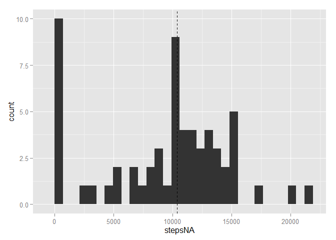
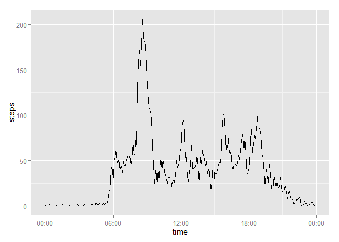
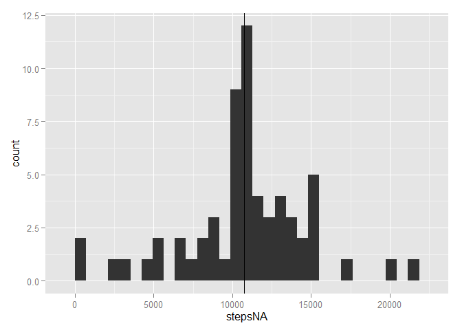
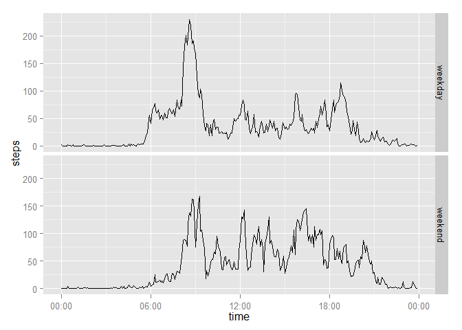

# Reproducible Research: Peer Assessment 1


## Loading and preprocessing the data


```r
#install.packages("ggplot2")
#install.packages("scales")
#install.packages("lubridate")
require(ggplot2)
require(scales)
require(lubridate)

activities <- read.csv('c:/data/activity.csv')

# create datetime variable from date + interval (minutes)
activities$datetime <- as.POSIXlt(activities$date)
activities$datetime$min <- activities$datetime$min + activities$interval %% 100
activities$datetime$hour <- activities$datetime$hour + activities$interval %/% 100
```

## What is mean total number of steps taken per day?


```r
x <- round(tapply(activities$steps, activities$date, sum, na.rm = TRUE))
stepsbydateNA <- data.frame(date=names(x), stepsNA=x)

stepsmean <- round(mean(stepsbydateNA$stepsNA, na.rm = TRUE))
stepsmedian <- round(median(stepsbydateNA$stepsNA, na.rm = TRUE))

paste("Mean steps (NAs included)", stepsmean)
```

```
## [1] "Mean steps (NAs included) 9354"
```

```r
paste("Median steps (NAs included)", stepsmedian)
```

```
## [1] "Median steps (NAs included) 10395"
```

```r
g <- ggplot(stepsbydateNA, aes(x=stepsNA))
g <- g + geom_histogram() + geom_vline(xintercept=stepsmedian, linetype = "dashed")
g
```

```
## stat_bin: binwidth defaulted to range/30. Use 'binwidth = x' to adjust this.
```

 

Before the NAs are imputed, the mean total steps taken per day is 9354, and the median total steps taken per day is 1.0395 &times; 10<sup>4</sup>.

## What is the average daily activity pattern?


```r
# average steps by 5 minute interval
x <- round(tapply(activities$steps, activities$interval, mean, na.rm=TRUE))
stepsbyinterval <- data.frame(interval=names(x), steps=x)

stepsbyinterval$interval <- as.integer(as.vector(stepsbyinterval$interval))
stepsbyinterval$steps <- as.integer(stepsbyinterval$steps)

row.names(stepsbyinterval) <- NULL

stepsbyinterval$datetime <- as.POSIXlt("2014-12-14 GMT")
stepsbyinterval$datetime$min <- stepsbyinterval$datetime$min + stepsbyinterval$interval %% 100
stepsbyinterval$datetime$hour <- stepsbyinterval$datetime$hour + stepsbyinterval$interval %/% 100

stepsbyinterval$time <- as.numeric(stepsbyinterval$datetime - trunc(stepsbyinterval$datetime, "days"))
stepsbyinterval$time <- as.Date(Sys.time()) + seconds(stepsbyinterval$time)

ggplot(stepsbyinterval, aes(x=time, y=steps)) + geom_line() + scale_x_datetime(labels = date_format("%H:00"))
```

 

```r
busiest5minuteinterval <- stepsbyinterval$interval[stepsbyinterval$steps == max(stepsbyinterval$steps)]
paste("Busiest 5 minute interval", busiest5minuteinterval, "; ", max(stepsbyinterval$steps), " steps.")
```

```
## [1] "Busiest 5 minute interval 835 ;  206  steps."
```

## Imputing missing values


```r
paste("There are", sum(is.na(activities$steps)), "missing step values")
```

```
## [1] "There are 2304 missing step values"
```

```r
nu <- activities

# calculate mean steps for each 5 minute interval 
nu$intervalmean <- round(with(nu, tapply(steps, interval, mean, na.rm = TRUE)))

# for 5 minute intervals where steps value is missing, replace with calculated mean steps
nu$steps <- ifelse(is.na(nu$steps), nu$intervalmean, nu$steps)

# View(nu)

x <- round(tapply(nu$steps, nu$date, sum))
stepsbydate <- data.frame(date=names(x), stepsNA=x)

stepsmean <- round(mean(stepsbydate$stepsNA, na.rm = TRUE))
stepsmedian <- round(median(stepsbydate$stepsNA, na.rm = TRUE))

# hist(stepsbydate$stepsNA)
g <- ggplot(stepsbydate, aes(x=stepsNA))
g <- g + geom_histogram() + geom_vline(xintercept=stepsmean) +
  geom_vline(xintercept=stepsmedian, linetype = "dashed")
g
```

```
## stat_bin: binwidth defaulted to range/30. Use 'binwidth = x' to adjust this.
```

 

```r
paste("Mean steps: ", stepsmean)
```

```
## [1] "Mean steps:  10766"
```

```r
paste("Median steps: ", stepsmedian)
```

```
## [1] "Median steps:  10762"
```

## Are there differences in activity patterns between weekdays and weekends?


```r
nu$weekend <- as.factor(ifelse(
  weekdays(nu$datetime) %in% c('Saturday', 'Sunday'), 'weekend', 'weekday'))

we <- subset(nu, nu$weekend == "weekend")
wd <- subset(nu, nu$weekend == "weekday")

View(wd)
View(we)


e <- round(tapply(we$steps, we$interval, mean, na.rm=TRUE))
westepsbyinterval <- data.frame(interval=names(e), steps=e)
westepsbyinterval$weekend <- "weekend"

d <- round(tapply(wd$steps, wd$interval, mean, na.rm=TRUE))
wdstepsbyinterval <- data.frame(interval=names(d), steps=d)
wdstepsbyinterval$weekend <- "weekday"

View(wdstepsbyinterval)
View(westepsbyinterval)

stepsbyinterval <- rbind(wdstepsbyinterval, westepsbyinterval)
View(stepsbyinterval)


stepsbyinterval$interval <- as.integer(as.vector(stepsbyinterval$interval))
stepsbyinterval$steps <- as.integer(stepsbyinterval$steps)

row.names(stepsbyinterval) <- NULL

stepsbyinterval$datetime <- as.POSIXlt("2014-12-14 GMT")
stepsbyinterval$datetime$min <- stepsbyinterval$datetime$min + stepsbyinterval$interval %% 100
stepsbyinterval$datetime$hour <- stepsbyinterval$datetime$hour + stepsbyinterval$interval %/% 100

stepsbyinterval$time <- as.numeric(stepsbyinterval$datetime - trunc(stepsbyinterval$datetime, "days"))
stepsbyinterval$time <- as.Date(Sys.time()) + seconds(stepsbyinterval$time)

p <- ggplot(stepsbyinterval, aes(x=time, y=steps)) + geom_line() + scale_x_datetime(labels = date_format("%H:00"))

p + facet_grid (weekend ~ .)
```

 

